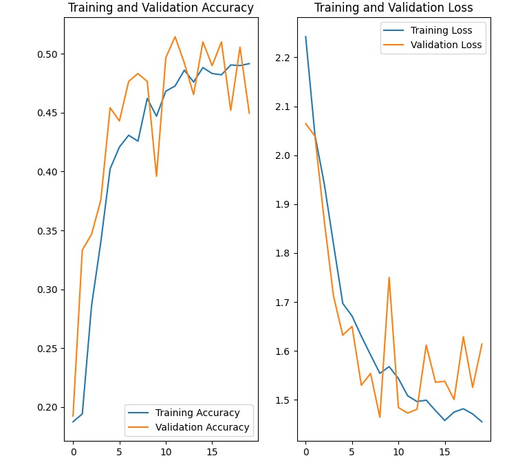
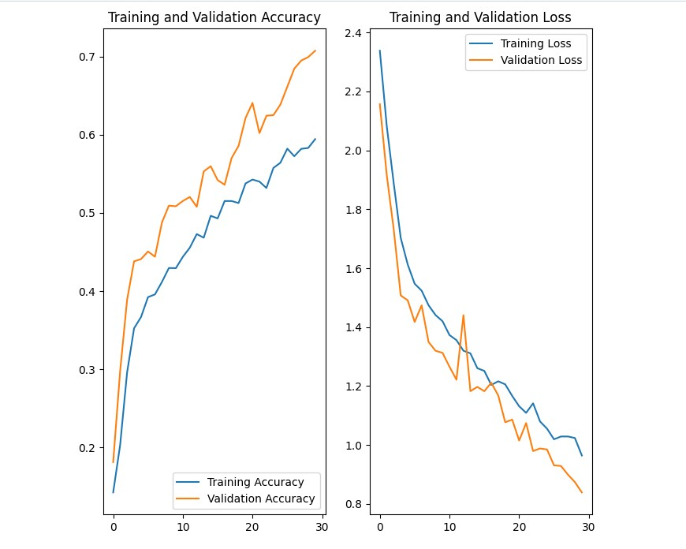
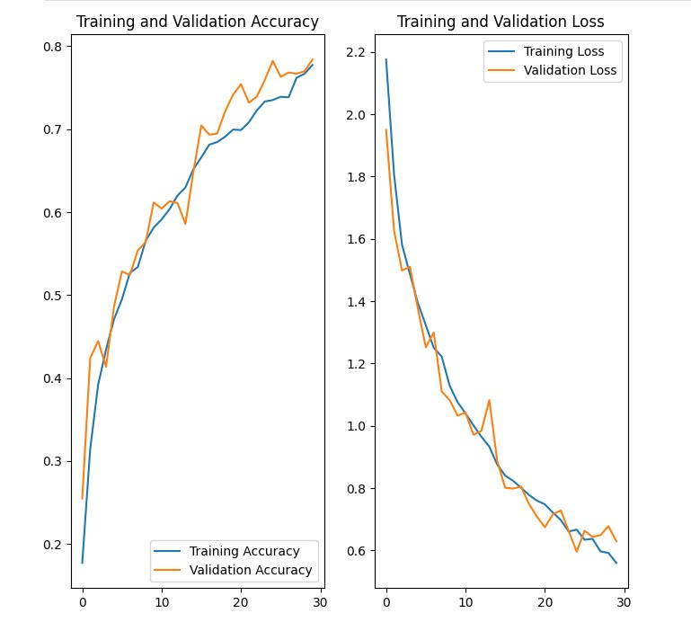

# MelanomaSkinCancerAssignmentDakshita
Melanoma. Skin Cancer Detection
This project uses a custom CNN to detect melanoma in images of skin lesions among 9 classes. The model predicts with an 85% accuracy.

## Problem statement
To build a CNN based model which can accurately detect melanoma. Melanoma is a type of cancer that can be deadly if not detected early. It accounts for 75% of skin cancer deaths. A solution that can evaluate images and alert dermatologists about the presence of melanoma has the potential to reduce a lot of manual effort needed in diagnosis.

## General Information
### ALogorithm Used
Convolution Neural Network

### Dataset Information

The dataset consists of 2357 images of malignant and benign oncological diseases, which were formed from the International Skin Imaging Collaboration (ISIC). All images were sorted according to the classification taken with ISIC, and all subsets were divided into the same number of images, with the exception of melanomas and moles, whose images are slightly dominant.
The data set contains the following diseases:
- Actinic keratosis
- Basal cell carcinoma
- Dermatofibroma
- Melanoma
- Nevus
- Pigmented benign keratosis
- Seborrheic keratosis
- Squamous cell carcinoma
- Vascular lesion

  ## Steps Involved

- Data Loading
- Baseline Model Building
- Training the Model and testing the model
- Building an augmented model
- Training the augmented model and testing the model
- Countering Class Imbalance with augmentor
- Building the final model
- Training the final model and testing the model
- Verifying the model

## Project Pipeline
- Data Reading/Data Understanding → Defining the path for train and test images 
- Dataset Creation→ Create train & validation dataset from the train directory with a batch size of 32. Also, make sure you resize your images to 180*180.
- Dataset visualisation → Create a code to visualize one instance of all the nine classes present in the dataset 
#### Model Building & training : 
- Create a CNN model, which can accurately detect 9 classes present in the dataset. While building the model, rescale images to normalize pixel values between (0,1).
- Choose an appropriate optimiser and loss function for model training
- Train the model for ~20 epochs
- Write your findings after the model fit. You must check if there is any evidence of model overfit or underfit.
- Chose an appropriate data augmentation strategy to resolve underfitting/overfitting 
#### Model Building & training on the augmented data :
- Create a CNN model, which can accurately detect 9 classes present in the dataset. While building the model rescale images to normalize pixel values between (0,1).
- Choose an appropriate optimiser and loss function for model training
- Train the model for ~20 epochs
- Write your findings after the model fit, see if the earlier issue is resolved or not?
- Class distribution: Examine the current class distribution in the training dataset 
- Which class has the least number of samples?
- Which classes dominate the data in terms of the proportionate number of samples?
- Handling class imbalances: Rectify class imbalances present in the training dataset with Augmentor library.
#### Model Building & training on the rectified class imbalance data :
- Create a CNN model, which can accurately detect 9 classes present in the dataset. While building the model, rescale images to normalize pixel values between (0,1).
- Choose an appropriate optimiser and loss function for model training
- Train the model for ~30 epochs
- Write your findings after the model fit, see if the issues are resolved or not?

  ## Results
  - Class Imbalance Detection: pigmented benign keratosis has highest number of images while seborrheic keratosis has lowest no. of images. Image distribution is not uniform across classes, it indicating Class Imbalance.
  ### Baseline Model

Accuracy and Loss charts for the baseline model

### Augmented Model

Accuracy and Loss charts for the augmented model

### Final Model

Accuracy and Loss charts for the final model
 - Model is trained with dropout layers placed after 1st & 2nd Convolution layer and dense layer. Validation accuracy is 75%.
 
 - On add one more droput layer after 3rd convolution layer. Accuracy has improved to 79%

- Increasing model complexity, validation accuracy has improved to 85%. 

